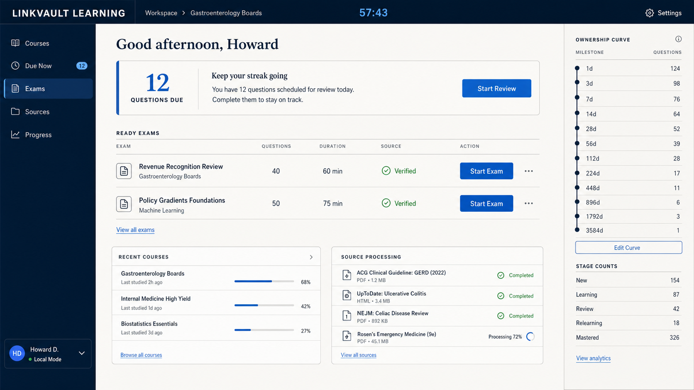
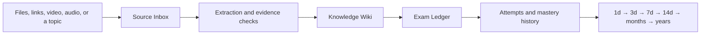
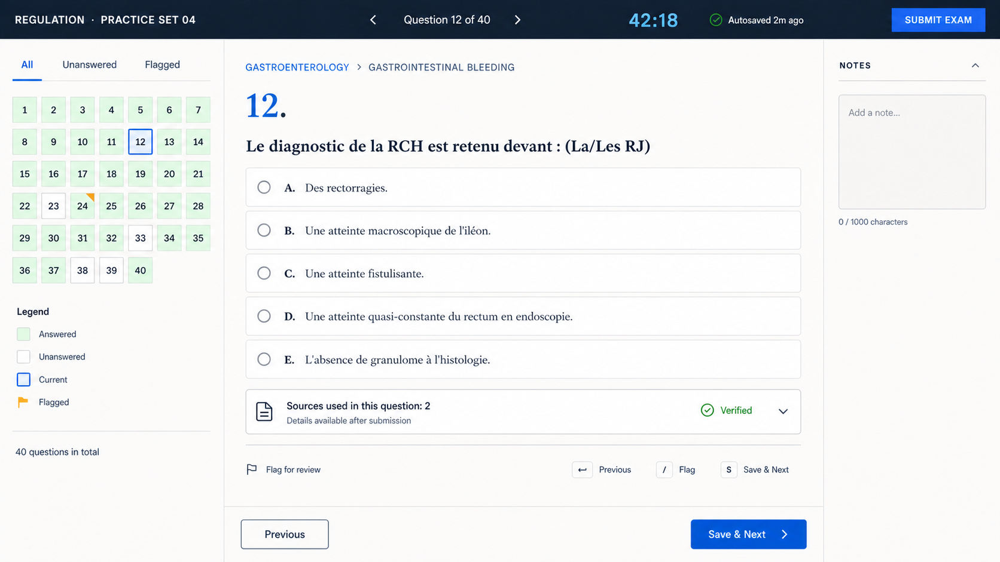

# Mastery Ledger

Turn scattered sources into grounded knowledge, exam practice, and a review record that can last for years.

> **Project status:** Mastery Ledger is currently a design and skill prototype. The standalone application/runtime described here is being specified and is not yet a finished release.



## What Mastery Ledger is

Mastery Ledger is a local-first learning workspace. Give it documents, websites, video, audio, subtitles, or a topic to research. Its workflow organizes those sources, records provenance, checks generated claims, builds a navigable knowledge wiki, creates exam-style assessments, and schedules the same knowledge for increasingly distant review.



The name **ledger** is intentional: source receipts, evidence decisions, questions, answers, and review history remain inspectable instead of disappearing after one chat.

## Demo: from an academic file organizer to lasting mastery

The repository includes a conceptual demo based on Ritika Tiwari's public presentation, [Introducing Study Ledger: A Comprehensive Academic Resource Management System](https://prezi.com/p/0xgcfk1r4fea/introducing-study-ledger-a-comprehensive-academic-resource-management-system/).

That presentation describes a local academic-resource organizer centered on course folders, document uploads, previews, subject browsing, search, privacy, and error handling. Mastery Ledger uses those requirements as an attributed input and demonstrates the next layer:

| Resource organization | Mastery Ledger extension |
|---|---|
| Upload and categorize files | Register sources with provenance and processing state |
| Browse by course or subject | Build a linked Knowledge Wiki from approved evidence |
| Preview and search documents | Search claims and jump back to precise source locations |
| Keep files local | Keep courses, attempts, and logs in a learner-selected workspace |
| Retrieve study material | Generate focused exams and explain supported correct answers |
| Maintain a clean archive | Track what is due until the learner owns the concept long-term |

Explore the complete [Study Ledger to Mastery Ledger demo](demo/study-ledger-course/README.md).

## Exam Ledger

Exam Ledger is the focused assessment interface inside Mastery Ledger. Learners answer selectable multiple-choice questions without hints. Incorrect choices are marked without revealing the answer; after a correct answer, the explanation becomes available and the source panel remains collapsed until opened.



Question content is data, not generated interface code. A fixed local web template renders validated exam files and records attempts back to the course workspace.

## Planned product areas

- **Source Inbox** — add files and links, inspect processing state, and revisit source provenance.
- **Knowledge Wiki** — browse source-grounded concepts and relationships.
- **Exam Ledger** — take focused mock exams and review supported explanations.
- **Review Queue** — see questions due on the ownership curve.
- **Evidence & Activity** — inspect source decisions, contradictions, agent handoffs, and machine-readable action events.

## Repository map

```text
README.md                                product overview and workflow
demo/study-ledger-course/                attributed, source-grounded demo
design-mockups/                          dashboard and exam-interface concepts
linkvault-learning/                      current pre-rename skill prototype
LINKVAULT_LEARNING_DESIGN_DECISIONS.md   architecture decision record
LLM Wiki.md                              original knowledge-wiki concept notes
LICENSE                                  MIT license
```

The `linkvault-learning` identifiers are historical prototype names. The application, CLI, storage paths, tests, and installable skill will move to the `mastery-ledger` namespace together in one migration.

## Attribution

The demo source is credited to Ritika Tiwari and linked directly. Its ideas are summarized and transformed in original wording; the presentation itself is not redistributed in this repository.
