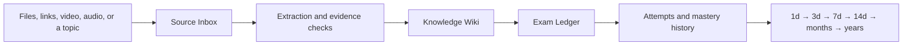
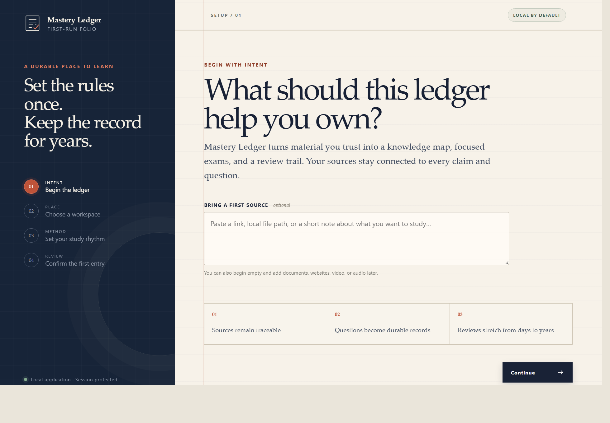

# Mastery Ledger

Turn documents, websites, video, audio, and researched topics into source-grounded courses, focused exams, and long-term review records.

> **Project status:** The developer preview now implements onboarding and repair, Source Inbox ingestion, Knowledge Wiki, Evidence & Activity, Focused Question exams, durable attempts, scheduled reviews, versioned curve settings, and the Codex skill adapter with executable research guards. OS-signed installers remain the release gate.


_Product interface direction using sample course data. The availability table below separates implemented preview behavior from planned surfaces._

## Install the preview

Mastery Ledger currently has two intentionally separate parts: the local application and the Codex skill adapter. Install both without cloning the repository:

```powershell
uv tool install "git+https://github.com/Howard-Starfield/Mastery-Ledger.git@main"
npx skills add Howard-Starfield/Mastery-Ledger@mastery-ledger -g -a codex -y --copy
mastery-ledger onboard --open --json
```

The commands expect [`uv`](https://docs.astral.sh/uv/getting-started/installation/) for the Python application and `npx` from Node.js for the skill installer. The first command installs the application into an isolated per-user environment. The second installs the skill for Codex, and the third opens application-owned setup so the learner can choose where their course workspace belongs. Restart Codex after installing the skill.

This is an unsigned development preview installed from the repository's moving `main` branch. It is suitable for testing, but it is not the future stable-release channel. A tagged, checksummed application release will replace this command before Mastery Ledger is presented as a learner-ready release.

## Install only the Codex skill

The repository already follows the standard `SKILL.md` layout and is discoverable by the open [`skills` CLI](https://github.com/vercel-labs/skills). Install the skill globally for Codex with one command:

```powershell
npx skills add Howard-Starfield/Mastery-Ledger@mastery-ledger -g -a codex -y --copy
```

This command installs the `mastery-ledger/` skill folder into Codex's global skill location. `--copy` avoids symlink-discovery and Windows permission problems. Start a new Codex task after installation.

The `skills` CLI is an open third-party installer maintained by Vercel Labs, not an OpenAI package. To inspect the repository without installing, run:

```powershell
npx skills add Howard-Starfield/Mastery-Ledger --list
```

Codex can also use its bundled `$skill-installer`. Paste this request into Codex:

```text
Install this skill globally for Codex:
https://github.com/Howard-Starfield/Mastery-Ledger/tree/main/mastery-ledger
```

Installing the skill does not install the standalone Mastery Ledger application. The application remains a separate runtime; follow [Install and test the preview](#install-and-test-the-preview) for the current development build.

## What Mastery Ledger is

Mastery Ledger is a local-first learning workspace. Give it documents, websites, video, audio, subtitles, or a topic to research. Its workflow organizes those sources, records provenance, checks generated claims, builds a navigable knowledge wiki, creates exam-style assessments, and schedules the same knowledge for increasingly distant review.



The name **ledger** is intentional: source receipts, evidence decisions, questions, answers, and review history remain inspectable instead of disappearing after one chat.

## Function showcase

Mastery Ledger has two cooperating layers: a local application for learner-facing setup and exams, and a Codex skill for source ingestion, research orchestration, evidence control, course generation, and tutoring workflows.

| Function | What it does | Availability |
|---|---|---|
| Guided onboarding | Selects and validates a learner-owned workspace, language, processing mode, accessibility preference, initial source, and review curve | Application preview |
| Runtime doctor | Reports machine-readable `ready` or `onboarding_required` state without opening a browser or mutating setup | Application preview |
| Exam Ledger dashboard | Discovers portable course manifests, ready exams, due questions, source readiness, recent courses, and Ownership Curve stages | Application preview |
| Ready Exam register | Provides an internally scrollable, searchable, course-filtered list backed by canonical `exam.json` files | Application preview |
| Focused Question exams | Delivers one question at a time with selectable answers, flags, navigation, timer, final submission, scoring, and review mode | Application preview |
| Answer isolation | Keeps answer keys, explanations, and citation details out of the initial browser payload; every answer locks after one submission | Application preview |
| Source disclosure | Shows no source details for an incorrect active answer; enables a still-collapsed citation panel after a correct answer and during final review | Application preview |
| Scheduled reviews | Starts source-grounded due questions from the dashboard and applies the configured Ownership Curve on final submission | Application preview |
| Ownership Curve settings | Edits, validates, versions, duplicates, and applies a review curve using an explicit schedule-migration policy | Application preview |
| Source intake and scope | Registers learner-provided files and links, records rights and provenance before processing, and supports adding sources to existing or new courses | Application preview + Codex skill workflow |
| Web and document ingestion | Runs recoverable jobs through isolated staging, promotes source Markdown and originals into a portable course, and records hashes, status, and recovery steps | Application preview |
| Video and audio processing | Uses the `yt-dlp` Python API, probes one public item, prefers human then automatic captions, and permits local `faster-whisper` transcription only after explicit approval and model configuration | Application preview + skill scripts |
| Research orchestration | Splits independent research into bounded tasks, routes completed reports through verification, and prevents reviewers from running before their dependencies | Codex skill workflow |
| Evidence and contradiction control | Separates claims, sources, contradictions, gaps, verification decisions, and approved evidence before learner-facing synthesis | Codex skill workflow |
| Knowledge Wiki | Browses approved and derived concepts, relationships, learner proficiency, contradictions, page Markdown, and exact source locators | Application preview + Codex skill artifacts |
| Evidence & Activity | Projects approved and rejected claims, contradictions, gaps, and observable action events without exposing hidden reasoning | Application preview |
| Course and assessment generation | Builds source-grounded study guides, knowledge pages, question banks, and exam definitions from approved evidence | Codex skill workflow |
| Citation validation | Validates source IDs, structured locators, support targets, answer explanations, and evidence packets before publication | Skill scripts |
| Mastery records | Persists attempts, restores interrupted sessions, updates each question's interval, and records idempotent concept evidence | Application preview |
| Tutoring and course updates | Runs source-grounded tutoring passes and reopens affected evidence, questions, and contradictions when sources or goals change | Codex skill workflow |

## Product interface

### Workspace and ready exams

The Exam Ledger landing page gathers due work, available exams, course state, source readiness, and the complete Ownership Curve without editing generated HTML for each course. The dashboard preview at the top of this README shows this surface.

## Exam Ledger

Exam Ledger is the focused assessment interface inside Mastery Ledger. Learners answer selectable multiple-choice questions without hints. Incorrect choices are marked without revealing the answer; after a correct answer, the explanation becomes available and the source panel remains collapsed until opened.


_Focused Question design direction. The current runner implements selectable answers, the question palette, flags, timer, scoring, source gating, and durable attempt autosave; persistent learner notes remain future work._

Question content is data, not generated interface code. A fixed local web template renders validated exam files. The application writes in-progress and completed attempts atomically under the course, restores compatible interrupted attempts after a restart, and updates the separate review queue only when final submission succeeds.

### First-run workspace setup

Onboarding belongs to the application. The skill can detect that setup is required, but the learner confirms the workspace and processing choices in the protected local interface.



## What is next

- **Stable distribution** — exercise the tagged artifact workflow, then add maintainer-controlled Windows/macOS signing and installer jobs.
- **Model management** — add an application-owned consent screen and managed cache before enabling local ASR model downloads.
- **Broader acceptance** — test large real-world course libraries and accessibility workflows across supported operating systems.

## Application architecture

The accepted standalone stack is a Python **FastAPI + SQLite** runtime with a **React + TypeScript** interface built by Vite. Release builds bundle the compiled frontend into the Python application, so learners do not need Node.js. Course knowledge and review artifacts remain portable files in a learner-selected workspace; SQLite holds the application index and durable processing queue.

Exact resolved Python graphs are recorded in `requirements/core.lock` and `requirements/transcription.lock`. The latter is optional because local ASR is intentionally not installed or model-configured during ordinary onboarding.

First-run onboarding belongs to the application because it validates and persists workspace, privacy, accessibility, dependency, and model-download choices. For an operational request, the optional Codex skill runs the read-only `mastery-ledger doctor --json --skill-version 0.1.0`; an `onboarding_required` result launches the fixed local onboarding command once, while `workspace_unavailable` launches explicit repair. A missing application is never downloaded or installed automatically. The skill passes proposed learning context without maintaining a second configuration system.

### Implemented application slice

- Read-only, versioned `mastery-ledger doctor --json --skill-version 0.1.0` compatibility output.
- Idempotent `mastery-ledger onboard --open --json` loopback launch.
- Explicit `mastery-ledger repair --open --json` launch, native folder chooser, and settings-preserving workspace reconnection.
- Session-protected FastAPI endpoints bound to `127.0.0.1`.
- SQLite-backed workspace registry and onboarding preferences.
- Absolute-path validation and atomic first-workspace creation.
- React onboarding for source invitation, workspace, privacy, accessibility, and editable review intervals.
- Workspace dashboard that discovers course manifests, ready exams, due questions, source readiness, and Ownership Curve stages from portable course files.
- Scrollable and searchable Ready Exams register with course filtering and an exam-detail sheet.
- Focused Question runner with a question map, flags, locked single submissions, final-submit checkpoint, scoring, and review mode.
- Server-side answer checking that keeps keys and gated explanations out of the initial browser payload.
- Collapsed source disclosure that unlocks after a correct answer and for every question after final submission.
- Atomic `attempts/ATTEMPT-*.json` records with restart recovery and immutable completed results.
- Idempotent `progress/review-queue.json` updates using the learner's configured Ownership Curve.
- Dashboard and exam-detail resume indicators for compatible in-progress attempts.
- Due Review runner backed by canonical question definitions, the existing answer-isolation rules, and durable review attempts.
- Idempotent `learner-progress.json` concept counts and evidence derived from deterministic multiple-choice results.
- Versioned Ownership Curve editor with direct interval controls, human horizon labels, warnings, reset, profile duplication, and explicit new-only, future-advancement, or recalculate-all policies.
- Per-question curve identity and intervals, with pending migrations applied only after the next completed due review and synchronized concept dates after an intentional recalculation.
- Durable Source Inbox registration, rights validation, course creation, filtering, retry, cancellation, and job-state polling.
- Recoverable ingestion worker with restart recovery, `.work/ingestion` staging, atomic promotion, and observable JSONL events.
- Local document, SRT/VTT, and media ingestion; public-web extraction; and subtitle-first remote video processing through the `yt-dlp` Python API.
- Canonical `source-manifest.yaml`, `source/SRC-*.md`, `source/media/SRC-*/`, and `logs/events.jsonl` course artifacts with legacy-manifest read compatibility.
- Knowledge Wiki concept index and pages with relationship navigation, learner state, contradiction counts, and a collated grounding ledger.
- Evidence Ledger and Activity Feed over portable evidence JSON and safe observable JSONL action fields.
- Canonical `wiki-v1`, completion-envelope, runtime-compatibility, and `.work/orchestration` skill artifacts with executable dependency-order validation.
- Prebuilt frontend assets served from the Python package; Node.js is not required at learner runtime.

## Install and test the preview

The complete repository-controlled preview is ready for developer testing. This is not yet an OS-signed learner release; completing onboarding shows a setup receipt with an action that opens Exam Ledger.

### 1. Install the local application

For a normal preview installation, `uv` can install the CLI directly from the official GitHub repository without a clone:

```powershell
uv tool install "git+https://github.com/Howard-Starfield/Mastery-Ledger.git@main"
```

The checked-in frontend build is included in the Python package, so Node.js is not required to launch and test onboarding. If `mastery-ledger` is not found afterward, run `uv tool update-shell` and open a new terminal.

To update the preview from `main`, reinstall it explicitly:

```powershell
uv tool install --force "git+https://github.com/Howard-Starfield/Mastery-Ledger.git@main"
```

For contributors who already cloned the repository, use an editable installation instead:

[`uv`](https://docs.astral.sh/uv/guides/tools/) provides the cleanest development installation because it gives the CLI an isolated environment while keeping this checkout editable:

```powershell
Set-Location D:\AI_projects\Tutor_AI
uv tool install --editable .
```

To refresh an editable installation after package metadata or dependencies change, run `uv tool install --editable . --force`.

### 2. Run the first-use flow

Confirm that the read-only runtime check reports `onboarding_required`:

```powershell
mastery-ledger doctor --json
```

Launch the protected loopback application and open onboarding in the default browser:

```powershell
mastery-ledger onboard --open --json
```

Complete all four setup steps, then verify that the same doctor command reports `ready`:

```powershell
mastery-ledger doctor --json
```

Expected transition:

```text
onboarding_required
  -> workspace validated and setup saved
  -> ready
```

### 3. What to test

- The browser opens only for the operational onboarding command, not for `doctor`.
- A relative workspace path is rejected and an absolute writable path is accepted.
- The suggested workspace is separate from the application and skill directories.
- A ready exam opens from its detail sheet and initially exposes no answer key, explanation, or citation details to the browser.
- Each question accepts one locked submission: an incorrect answer reveals no hint, while a correct answer reveals its explanation and enables a still-collapsed source disclosure.
- Final submission reports the score and enables still-collapsed sources for every question in review mode.

- Closing or restarting the local application restores the same compatible in-progress attempt and its locked answers.
- Final submission writes a complete attempt result and updates each question's review record exactly once.
- A correct due answer advances one stage, an incorrect due answer resets to stage zero, and early practice does not advance the schedule.
- The Due Now action opens deliverable scheduled questions and returns the learner to the refreshed dashboard after final submission.
- Ownership Curve settings reject invalid or descending stages, show the number of scheduled questions, and require confirmation before recalculating pending dates.
- Future advancement preserves current due dates until the next completed due review; new-question-only preserves every existing curve version.
- Course cards report how many concepts have evidence and how many have reached a proficient or stable state.
- Source invitation may be completed or left empty.
- Processing mode, language, reduced motion, and the review curve survive the final confirmation.
- The default curve includes `1, 3, 7, 14, 28, 56, 112, 224, 448, 896, 1792, 3584` days.
- No ASR model, FFmpeg binary, or source media is downloaded during onboarding.
- A second `mastery-ledger doctor --json` reports the saved workspace and `ready` status.
- Removing or moving the registered folder reports `workspace_unavailable`; `mastery-ledger repair --open --json` opens explicit reconnection without changing learning settings.
- The Exam Ledger dashboard discovers only exams whose canonical `exam.json` status is `ready`.
- Search and course filters operate within the internally scrollable Ready Exams register.
- Due totals and Ownership Curve counts match each course's `progress/review-queue.json` records.
- Source Inbox preserves existing legacy manifest records, writes a pending receipt before processing, and shows queued, running, complete, failed, or cancelled durable jobs.
- Local documents are processed from `.work/ingestion`, promoted to `source/SRC-*.md` plus `source/media/SRC-*/`, and leave no successful staging directory behind.
- Remote videos are probed without credentials or user configuration, prefer human captions over automatic captions, and do not download media unless transcription is approved and a local ASR model is configured.
- Knowledge Wiki renders canonical pages and derives a useful concept index when optional wiki artifacts are absent.
- Evidence & Activity displays decisions, exact artifact/source IDs, contradictions, and malformed-log warnings without passing unknown or private reasoning fields through the API.
- The orchestration validator exposes only dependency-ready task IDs and blocks contradiction or citation reviewers until their prerequisite completion envelopes are submitted.

For an isolated manual run that does not touch the normal per-user registry or course location, set these variables in the same terminal before running `doctor` or `onboard`:

```powershell
$env:MASTERY_LEDGER_HOME = "$PWD\.work\manual-runtime"
$env:MASTERY_LEDGER_DEFAULT_WORKSPACE = "$PWD\.work\manual-courses"
```

Both locations are under the ignored `.work/` directory.

### 4. Run the automated checks

Create a project-local development environment without using PowerShell activation scripts:

```powershell
python -m venv .venv
& .\.venv\Scripts\python.exe -m pip install -e ".[dev]"
& .\.venv\Scripts\python.exe -m pytest -q tests mastery-ledger/tests
```

Validate or modify the frontend:

```powershell
Set-Location D:\AI_projects\Tutor_AI\web
npm.cmd ci
npm.cmd test
npm.cmd run build
```

`npm run build` replaces the bundled assets under `src/mastery_ledger/web/`; commit those assets with the frontend source when the UI changes.

### 5. Install the Codex skill adapter

The application and `$mastery-ledger` skill are separate install surfaces. The recommended global Codex installation is:

```powershell
npx skills add Howard-Starfield/Mastery-Ledger@mastery-ledger -g -a codex -y --copy
```

Verify, update, or remove the installation with:

```powershell
npx skills list -g -a codex
npx skills update mastery-ledger -g -y
npx skills remove mastery-ledger -g -a codex -y
```

For users who prefer Codex's bundled system installer instead of the third-party `npx` CLI:

```powershell
python "$env:USERPROFILE\.codex\skills\.system\skill-installer\scripts\install-skill-from-github.py" `
  --repo Howard-Starfield/Mastery-Ledger `
  --path mastery-ledger
```

Start a new Codex task afterward so the skill can be discovered. The skill expects the `mastery-ledger` application command installed above to be available on `PATH`.

### Local files and Git hygiene

`uv tool install` stores its managed tool environment outside this repository, so there is no `uv` folder to remove or ignore. This repository already ignores `.venv/`, `node_modules/`, `build/`, `dist/`, `*.egg-info/`, `.work/`, and generated local course/runtime directories.

Do not add `uv.lock` to `.gitignore` if one is introduced later. A project lockfile is intended to be committed so contributors and releases resolve the same dependencies.

Remove the development application installation with:

```powershell
uv tool uninstall mastery-ledger
```

Tagged releases automatically build checksummed, provenance-attested Python artifacts. See [RELEASE.md](RELEASE.md). The skill will not describe the release as a signed learner-ready installer until maintainer-controlled OS signing is configured.

## Repository map

```text
README.md                                product overview and workflow
pyproject.toml                           Python package and CLI definition
src/mastery_ledger/                      FastAPI runtime, SQLite state, and bundled web assets
web/                                     React and TypeScript frontend source
tests/                                   application contract tests
design-mockups/                          dashboard and exam-interface concepts
mastery-ledger/                         installable skill prototype
MASTERY_LEDGER_DESIGN_DECISIONS.md      architecture decision record
RELEASE.md                              release gates, checksums, attestations, and signing boundary
.github/workflows/                      cross-platform CI and tagged artifact release
LLM Wiki.md                              original knowledge-wiki concept notes
LICENSE                                  MIT license
```

The installable skill uses the `mastery-ledger` identity. LinkVault appears only as an optional source connector; it is not a runtime dependency or storage owner.
