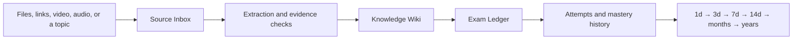

# Mastery Ledger

Turn scattered sources into grounded knowledge, exam practice, and a review record that can last for years.

> **Project status:** Mastery Ledger now includes executable onboarding, a workspace-backed Exam Ledger dashboard, Focused Question exam delivery, and the skill prototype. Course ingestion, durable attempt history, scheduled review execution, and signed installers remain under development.


## Install the preview

Mastery Ledger currently has two intentionally separate parts: the local application and the Codex skill adapter. Install both without cloning the repository:

```powershell
uv tool install "git+https://github.com/Howard-Starfield/Mastery-Ledger.git@main"
npx skills add Howard-Starfield/Mastery-Ledger@mastery-ledger -g -a codex -y --copy
mastery-ledger onboard --open --json
```

The commands expect [`uv`](https://docs.astral.sh/uv/getting-started/installation/) for the Python application and `npx` from Node.js for the skill installer. The first command installs the application into an isolated per-user environment. The second installs the skill for Codex, and the third opens application-owned setup so the learner can choose where their course workspace belongs. Restart Codex after installing the skill.

This is an unsigned development preview installed from the repository's moving `main` branch. It is suitable for testing, but it is not the future stable-release channel. A tagged, checksummed application release will replace this command before Mastery Ledger is presented as a learner-ready release.

## Install only the Codex skill

The repository already follows the standard `SKILL.md` layout and is discoverable by the open [`skills` CLI](https://github.com/vercel-labs/skills). Install the skill globally for Codex with one command:

```powershell
npx skills add Howard-Starfield/Mastery-Ledger@mastery-ledger -g -a codex -y --copy
```

This command installs the `mastery-ledger/` skill folder into Codex's global skill location. `--copy` avoids symlink-discovery and Windows permission problems. Start a new Codex task after installation.

The `skills` CLI is an open third-party installer maintained by Vercel Labs, not an OpenAI package. To inspect the repository without installing, run:

```powershell
npx skills add Howard-Starfield/Mastery-Ledger --list
```

Codex can also use its bundled `$skill-installer`. Paste this request into Codex:

```text
Install this skill globally for Codex:
https://github.com/Howard-Starfield/Mastery-Ledger/tree/main/mastery-ledger
```

Installing the skill does not install the standalone Mastery Ledger application. The application remains a separate runtime; follow [Install and test the preview](#install-and-test-the-preview) for the current development build.

## What Mastery Ledger is

Mastery Ledger is a local-first learning workspace. Give it documents, websites, video, audio, subtitles, or a topic to research. Its workflow organizes those sources, records provenance, checks generated claims, builds a navigable knowledge wiki, creates exam-style assessments, and schedules the same knowledge for increasingly distant review.



The name **ledger** is intentional: source receipts, evidence decisions, questions, answers, and review history remain inspectable instead of disappearing after one chat.

## Demo: from an academic file organizer to lasting mastery

The repository includes a conceptual demo based on Ritika Tiwari's public presentation, [Introducing Study Ledger: A Comprehensive Academic Resource Management System](https://prezi.com/p/0xgcfk1r4fea/introducing-study-ledger-a-comprehensive-academic-resource-management-system/).

That presentation describes a local academic-resource organizer centered on course folders, document uploads, previews, subject browsing, search, privacy, and error handling. Mastery Ledger uses those requirements as an attributed input and demonstrates the next layer:

| Resource organization | Mastery Ledger extension |
|---|---|
| Upload and categorize files | Register sources with provenance and processing state |
| Browse by course or subject | Build a linked Knowledge Wiki from approved evidence |
| Preview and search documents | Search claims and jump back to precise source locations |
| Keep files local | Keep courses, attempts, and logs in a learner-selected workspace |
| Retrieve study material | Generate focused exams and explain supported correct answers |
| Maintain a clean archive | Track what is due until the learner owns the concept long-term |

Explore the complete [Study Ledger to Mastery Ledger demo](demo/study-ledger-course/README.md).

## Exam Ledger

Exam Ledger is the focused assessment interface inside Mastery Ledger. Learners answer selectable multiple-choice questions without hints. Incorrect choices are marked without revealing the answer; after a correct answer, the explanation becomes available and the source panel remains collapsed until opened.


Question content is data, not generated interface code. A fixed local web template renders validated exam files. The current preview keeps an active attempt in application memory; the next persistence slice will write durable attempt and review records back to the course workspace.

## Planned product areas

- **Source Inbox** — add files and links, inspect processing state, and revisit source provenance.
- **Knowledge Wiki** — browse source-grounded concepts and relationships.
- **Exam Ledger** — take focused mock exams and review supported explanations.
- **Review Queue** — see questions due on the ownership curve.
- **Evidence & Activity** — inspect source decisions, contradictions, agent handoffs, and machine-readable action events.

## Application architecture

The accepted standalone stack is a Python **FastAPI + SQLite** runtime with a **React + TypeScript** interface built by Vite. Release builds bundle the compiled frontend into the Python application, so learners do not need Node.js. Course knowledge and review artifacts remain portable files in a learner-selected workspace; SQLite holds the application index and durable processing queue.

First-run onboarding belongs to the application because it validates and persists workspace, privacy, accessibility, dependency, and model-download choices. For an operational request, the optional Codex skill runs the read-only `mastery-ledger doctor --json`; an `onboarding_required` result launches the fixed local onboarding command once. A missing application is never downloaded or installed automatically. The skill passes proposed learning context without maintaining a second configuration system.


### Implemented application slice

- Read-only, versioned `mastery-ledger doctor --json` output.
- Idempotent `mastery-ledger onboard --open --json` loopback launch.
- Session-protected FastAPI endpoints bound to `127.0.0.1`.
- SQLite-backed workspace registry and onboarding preferences.
- Absolute-path validation and atomic first-workspace creation.
- React onboarding for source invitation, workspace, privacy, accessibility, and editable review intervals.
- Workspace dashboard that discovers course manifests, ready exams, due questions, source readiness, and Ownership Curve stages from portable course files.
- Scrollable and searchable Ready Exams register with course filtering and an exam-detail sheet.
- Focused Question runner with a question map, flags, locked single submissions, final-submit checkpoint, scoring, and review mode.
- Server-side answer checking that keeps keys and gated explanations out of the initial browser payload.
- Collapsed source disclosure that unlocks after a correct answer and for every question after final submission.
- Prebuilt frontend assets served from the Python package; Node.js is not required at learner runtime.

## Install and test the preview

The onboarding, workspace dashboard, and Focused Question slices are ready for developer testing. This is not yet a signed learner release; completing onboarding shows a setup receipt with an action that opens Exam Ledger.

### 1. Install the local application

For a normal preview installation, `uv` can install the CLI directly from the official GitHub repository without a clone:

```powershell
uv tool install "git+https://github.com/Howard-Starfield/Mastery-Ledger.git@main"
```

The checked-in frontend build is included in the Python package, so Node.js is not required to launch and test onboarding. If `mastery-ledger` is not found afterward, run `uv tool update-shell` and open a new terminal.

To update the preview from `main`, reinstall it explicitly:

```powershell
uv tool install --force "git+https://github.com/Howard-Starfield/Mastery-Ledger.git@main"
```

For contributors who already cloned the repository, use an editable installation instead:

[`uv`](https://docs.astral.sh/uv/guides/tools/) provides the cleanest development installation because it gives the CLI an isolated environment while keeping this checkout editable:

```powershell
Set-Location D:\AI_projects\Tutor_AI
uv tool install --editable .
```

To refresh an editable installation after package metadata or dependencies change, run `uv tool install --editable . --force`.

### 2. Run the first-use flow

Confirm that the read-only runtime check reports `onboarding_required`:

```powershell
mastery-ledger doctor --json
```

Launch the protected loopback application and open onboarding in the default browser:

```powershell
mastery-ledger onboard --open --json
```

Complete all four setup steps, then verify that the same doctor command reports `ready`:

```powershell
mastery-ledger doctor --json
```

Expected transition:

```text
onboarding_required
  -> workspace validated and setup saved
  -> ready
```

### 3. What to test

- The browser opens only for the operational onboarding command, not for `doctor`.
- A relative workspace path is rejected and an absolute writable path is accepted.
- The suggested workspace is separate from the application and skill directories.
- A ready exam opens from its detail sheet and initially exposes no answer key, explanation, or citation details to the browser.
- Each question accepts one locked submission: an incorrect answer reveals no hint, while a correct answer reveals its explanation and enables a still-collapsed source disclosure.
- Final submission reports the score and enables still-collapsed sources for every question in review mode.

Exam attempts currently live in application memory and reset when the local server stops. Durable attempt files and review scheduling are the next persistence slice.
- Source invitation may be completed or left empty.
- Processing mode, language, reduced motion, and the review curve survive the final confirmation.
- The default curve includes `1, 3, 7, 14, 28, 56, 112, 224, 448, 896, 1792, 3584` days.
- No ASR model, FFmpeg binary, or source media is downloaded during onboarding.
- A second `mastery-ledger doctor --json` reports the saved workspace and `ready` status.
- The Exam Ledger dashboard discovers only exams whose canonical `exam.json` status is `ready`.
- Search and course filters operate within the internally scrollable Ready Exams register.
- Due totals and Ownership Curve counts match each course's `progress/review-queue.json` records.

For an isolated manual run that does not touch the normal per-user registry or course location, set these variables in the same terminal before running `doctor` or `onboard`:

```powershell
$env:MASTERY_LEDGER_HOME = "$PWD\.work\manual-runtime"
$env:MASTERY_LEDGER_DEFAULT_WORKSPACE = "$PWD\.work\manual-courses"
```

Both locations are under the ignored `.work/` directory.

### 4. Run the automated checks

Create a project-local development environment without using PowerShell activation scripts:

```powershell
python -m venv .venv
& .\.venv\Scripts\python.exe -m pip install -e ".[dev]"
& .\.venv\Scripts\python.exe -m pytest -q tests mastery-ledger/tests
```

Validate or modify the frontend:

```powershell
Set-Location D:\AI_projects\Tutor_AI\web
npm.cmd ci
npm.cmd test
npm.cmd run build
```

`npm run build` replaces the bundled assets under `src/mastery_ledger/web/`; commit those assets with the frontend source when the UI changes.

### 5. Install the Codex skill adapter

The application and `$mastery-ledger` skill are separate install surfaces. The recommended global Codex installation is:

```powershell
npx skills add Howard-Starfield/Mastery-Ledger@mastery-ledger -g -a codex -y --copy
```

Verify, update, or remove the installation with:

```powershell
npx skills list -g -a codex
npx skills update mastery-ledger -g -y
npx skills remove mastery-ledger -g -a codex -y
```

For users who prefer Codex's bundled system installer instead of the third-party `npx` CLI:

```powershell
python "$env:USERPROFILE\.codex\skills\.system\skill-installer\scripts\install-skill-from-github.py" `
  --repo Howard-Starfield/Mastery-Ledger `
  --path mastery-ledger
```

Start a new Codex task afterward so the skill can be discovered. The skill expects the `mastery-ledger` application command installed above to be available on `PATH`.

### Local files and Git hygiene

`uv tool install` stores its managed tool environment outside this repository, so there is no `uv` folder to remove or ignore. This repository already ignores `.venv/`, `node_modules/`, `build/`, `dist/`, `*.egg-info/`, `.work/`, and generated local course/runtime directories.

Do not add `uv.lock` to `.gitignore` if one is introduced later. A project lockfile is intended to be committed so contributors and releases resolve the same dependencies.

Remove the development application installation with:

```powershell
uv tool uninstall mastery-ledger
```

The official release page will not be recommended by the skill until a compatible signed artifact and checksum manifest exist.

## Repository map

```text
README.md                                product overview and workflow
pyproject.toml                           Python package and CLI definition
src/mastery_ledger/                      FastAPI runtime, SQLite state, and bundled web assets
web/                                     React and TypeScript frontend source
tests/                                   application contract tests
demo/study-ledger-course/                attributed, source-grounded demo
design-mockups/                          dashboard and exam-interface concepts
mastery-ledger/                         installable skill prototype
MASTERY_LEDGER_DESIGN_DECISIONS.md      architecture decision record
LLM Wiki.md                              original knowledge-wiki concept notes
LICENSE                                  MIT license
```

The installable skill now uses the `mastery-ledger` identity. LinkVault appears only as an optional source connector; it is not a runtime dependency or storage owner.

## Attribution

The demo source is credited to Ritika Tiwari and linked directly. Its ideas are summarized and transformed in original wording; the presentation itself is not redistributed in this repository.
