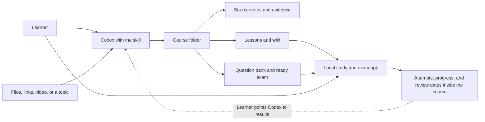
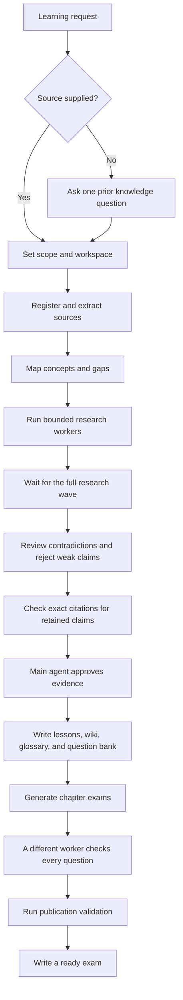
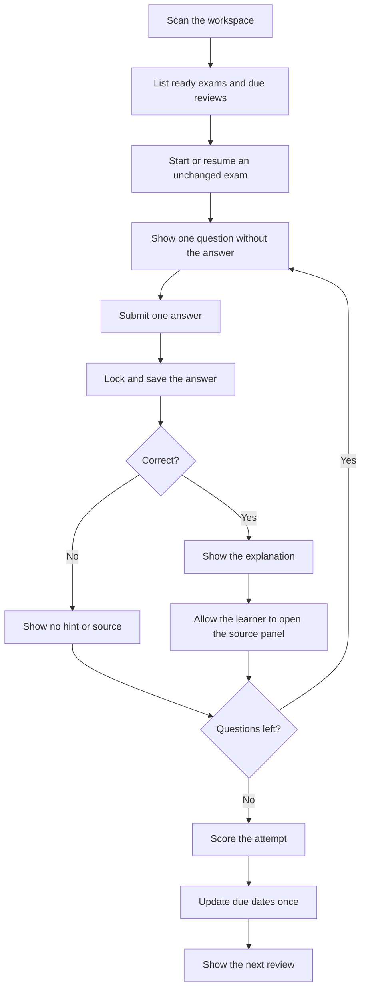

# Mastery Ledger

Mastery Ledger turns sources into a course, a test bank, and a review schedule you can keep on your own computer.

Codex reads the material, checks the claims, and writes the course. A local app runs the exams, records each attempt, and brings questions back for later review.

Built for OpenAI Dev Week.


## Why I made it

I used to finish LinkedIn Learning courses and feel that I understood them. A few days later, much of the detail was gone. Watching helped me follow an idea. It did not make me retrieve that idea without the video.

Memory research gives this problem several useful names:

| Term | Plain meaning |
| --- | --- |
| Forgetting curve | Recall tends to fall as the delay after learning grows. The exact curve depends on the person, material, and test. |
| Retrieval practice | Trying to recall an answer can strengthen later memory. A test can teach as well as measure. |
| Testing effect | The measured gain in later retention after retrieval practice. |
| Spacing effect | Practice spread across time usually lasts longer than the same practice packed into one sitting. |
| Distributed practice | The research term for study or review sessions separated by time. |
| Metacognitive error | Feeling familiar with material is not the same as being able to recall it later. |

A 2006 review found 839 comparisons across 317 experiments in 184 articles. It found a broad benefit from spaced practice, while also showing that the best gap depends on how long the learner needs to retain the material. There is no single interval that fits every subject or learner. See [Cepeda and colleagues](https://doi.org/10.1037/0033-2909.132.3.354).

In one experiment with 180 university students, the group that studied a passage once and took three recall tests remembered 61 percent after one week. The group that studied the passage four times remembered 40 percent. During the first session, the groups recorded an average of 3.4 readings and 14.2 readings respectively. See [Roediger and Karpicke](https://doi.org/10.1111/j.1467-9280.2006.01693.x).

Ebbinghaus called the early loss of access to learned material the forgetting curve. A later replication found a similar shape after one participant spent 70 hours learning and relearning word lists across delays from 20 minutes to 31 days. The narrow sample also shows why claims such as “everyone forgets a fixed percentage in one day” are false. See [Murre and Dros](https://doi.org/10.1371/journal.pone.0120644).

These studies do not prove one perfect review calendar. They support two practical choices: ask the learner to retrieve the answer, and repeat that work over time.

Mastery Ledger starts with this editable schedule:

| Review | Delay | Approximate span |
| ---: | ---: | ---: |
| 1 | 1 day | 1 day |
| 2 | 3 days | 3 days |
| 3 | 7 days | 1 week |
| 4 | 14 days | 2 weeks |
| 5 | 28 days | 4 weeks |
| 6 | 56 days | 8 weeks |
| 7 | 112 days | 4 months |
| 8 | 224 days | 7 months |
| 9 | 448 days | 1.2 years |
| 10 | 896 days | 2.5 years |
| 11 | 1792 days | 4.9 years |
| 12 | 3584 days | 9.8 years |

This curve is a clear product rule. It is not FSRS, SM 2, or proof of permanent memory. The learner can change it in the app.

## What the repository contains

Mastery Ledger has two parts.

| Part | Job | Writes |
| --- | --- | --- |
| Codex skill | Reads sources, runs research, checks evidence, writes lessons, and builds exams | Course files inside the learner's workspace |
| Local app | Reads published lessons, finds ready exams, runs practice sessions, scores answers, and schedules review | Attempts, progress, review dates, and local settings |

The app does not browse the web, download video, transcribe audio, write lessons, or generate questions. The skill does not own the exam screen or learner history, but it can read a completed attempt or progress file when the learner explicitly points to it.



The course folder is the boundary between the two parts. It remains useful even when the app or skill is not running.

## How a course is built

### 1. Learn where the learner starts

If the first request contains only a topic, Codex asks one open question: what does the learner already know? That answer sets the starting level. It is not treated as a factual source.

If the learner supplies a file, folder, link, excerpt, video, or existing course, Codex skips that question and starts with the supplied material.

### 2. Choose the workspace and scope

The learner chooses the folder before the first course file is written. The skill does not discover that folder through the local app, its settings, or a doctor command. Codex records the goal, level, source policy, limits, and accepted related topics in `study.yaml`.

For a researched course, Codex also states how many questions it will ask during calibration and how many workers it plans to use. The learner can change or skip the diagnostic.

### 3. Read and preserve sources

Each source receives an ID, rights basis, content hash, and exact location record in `source-manifest.yaml`.

Extracted notes go in `source/`. Originals, captions, transcripts, audio, and video go in `source/media/`. Temporary files stay in `.work/`.

Video work follows this order:

1. Use supplied subtitles.
2. Ask the platform for permitted captions.
3. Download permitted media only when needed.
4. Use local transcription only when the learner approves the model and download.

The skill uses the Python `yt-dlp` package when it is available. FFmpeg remains an optional system tool. The skill does not fetch either tool without consent.

### 4. Run research in a fixed order

Research workers do not write the final course. They submit evidence to private task folders under `.work/`. Each worker gets one role, one scope, and one output path.



The order matters. The citation worker waits until contradiction review has removed claims that should not be used. The question checker waits until generation is complete. A worker cannot approve its own work.

### 5. Publish only checked material

The main agent promotes only approved evidence into the course. Published questions must have four options, one answer, a concise explanation, concept links, and exact source references.

Each core chapter uses ten questions:

* Eight concise multiple choice questions
* Two short reading passages with multiple choice questions

Short and optional chapters use five questions with the same four to one ratio.

### 6. Keep the work visible

The learner sees the finished course. Reviewers can inspect the work behind it.

| Location | Contents |
| --- | --- |
| `source/` | Extracted notes with source locations |
| `evidence/` | Approved claims, contradictions, and gaps |
| `lessons/` | Reading material for each chapter |
| `wiki/` | Concept pages and links |
| `questions/` | The JSON test bank and its Markdown copy |
| `exams/` | Ready exam files read by the app |
| `logs/events.jsonl` | Actions, decisions, evidence paths, and short reasons |
| `.work/` | Worker reports, drafts, temporary files, and rejected work |

Logs record observable work. They do not record hidden reasoning.

The app's `Study` tab reads only lessons from courses in `learning_active`. `Read` mode renders Markdown and embedded HTML in an isolated read-only document. `Raw` mode displays the exact Markdown and HTML source without rendering it. The app never edits either form.

## How reading and practice work

The app reads validated chapter lessons and ready `exam.json` files. Lessons remain read-only; practice shows one question at a time.



A wrong answer gives no hint. A correct answer reveals the explanation. The source panel stays closed until the learner opens it. Final review shows the answer and its supporting source.

When the skill rebuilds an exam with the same ID, the app uses the new file for the next attempt. It does not keep a second drift database. Completed attempts remain as history. A partial attempt resumes only when the exam has not changed.

## Install from a cloned repository

You need Python 3.11 or newer, [uv](https://docs.astral.sh/uv/getting-started/installation/), Git, and Node.js with `npx` for the Codex skill installer.

Clone the repository:

```powershell
git clone https://github.com/Howard-Starfield/Mastery-Ledger.git
Set-Location Mastery-Ledger
```

Install the local exam app:

```powershell
uv tool install . --force --no-cache
mastery-ledger doctor --json
mastery-ledger onboard --open --json
```

On first use, choose the workspace that will hold your course folders. The same command opens the running app on later uses:

```powershell
mastery-ledger onboard --open --json
```

Install the Codex skill from the clone:

```powershell
npx.cmd skills add ./mastery-ledger -g -a codex -y --copy
npx.cmd skills list -g -a codex
```

Open a new Codex task after installation so Codex reads the new skill.

## Update both parts after a pull

The app and skill are separate installs. Update both:

```powershell
Set-Location Mastery-Ledger
git pull --ff-only
mastery-ledger stop --json
uv tool install . --force --no-cache
npx.cmd skills update mastery-ledger -g -y
mastery-ledger doctor --json
```

If you edit the Python app in the clone, use an editable install:

```powershell
mastery-ledger stop --json
uv tool install --editable . --force --no-cache
```

Changes under `src/mastery_ledger/` then apply without another install. Frontend changes still require a new web build.

## Install without cloning

Install the current development preview of the app:

```powershell
uv tool install "git+https://github.com/Howard-Starfield/Mastery-Ledger.git@main"
mastery-ledger onboard --open --json
```

Install the skill from GitHub:

```powershell
npx.cmd skills add Howard-Starfield/Mastery-Ledger@mastery-ledger -g -a codex -y --copy
```

This is an unsigned preview. Signed operating system installers are not ready.

## Start a course

Open a new Codex task and ask:

```text
Use Mastery Ledger to help me learn how large language models work.
```

Codex will first ask what you already know. To skip that question, include a source:

```text
Use Mastery Ledger to build a course from https://example.com/my-source
```

Codex asks for a workspace when the request does not identify an existing course or previously approved path in the conversation. The skill never invokes the app, doctor, onboarding, or a handoff command. Install and open the app separately only when you want its exam interface and review schedule. To continue tutoring from app results, point Codex to the course's completed attempt or `progress/learner-progress.json` file.

## Run the tests

Run all Python and skill tests from the repository root:

```powershell
python -m venv .venv
& .\.venv\Scripts\python.exe -m pip install -e ".[dev]"
& .\.venv\Scripts\python.exe -m pytest -q tests mastery-ledger/tests
```

Run the frontend tests and build:

```powershell
Set-Location web
npm.cmd ci
npm.cmd test
npm.cmd run build
```

The frontend build writes files to `src/mastery_ledger/web/`. Commit those files with any frontend change.

## Current limits

* The review curve is a product rule, not a proven memory model.
* Local transcription needs the optional `faster-whisper` package and a model approved by the learner.
* The current wiki uses `wiki/wiki.json`. The planned Markdown catalog is not built yet.
* Releases do not yet include signed operating system installers.

Mastery Ledger uses the [MIT License](LICENSE).
