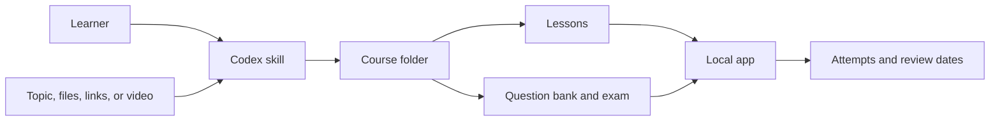

# Mastery Ledger

Mastery Ledger turns source material into cited lessons, exams, and a review schedule that stays on your computer.

The Codex skill reads and checks the material, then writes the course. The local app lets you read lessons, take exams, and revisit questions over time.

Built for OpenAI Dev Week.


## Quick start

Mastery Ledger has two parts. Install the app for reading and exams. Install the Codex skill to build courses.

You need Python 3.11 or newer, [uv](https://docs.astral.sh/uv/getting-started/installation/), Git, and Node.js with `npx`.

Clone the repository:

```powershell
git clone https://github.com/Howard-Starfield/Mastery-Ledger.git
Set-Location Mastery-Ledger
```

Install the app:

```powershell
uv tool install . --force --no-cache
mastery-ledger onboard --open
```

During setup, choose one of these locations:

* A single course folder
* A folder whose direct children are courses
* A workspace that keeps its courses inside `courses/`

After setup, open the app from any drive or directory:

```powershell
mastery-ledger open
```

Install the Codex skill:

```powershell
npx.cmd skills add ./mastery-ledger -g -a codex -y --copy
npx.cmd skills list -g -a codex
```

Open a new Codex task after installation so Codex can load the skill.

## Start a course

Ask Codex to use Mastery Ledger:

```text
Use Mastery Ledger to help me learn how large language models work.
```

If you already have material, include it:

```text
Use Mastery Ledger to build a course from https://example.com/my-source
```

When you provide material, the skill uses it as the sole source by default. You may later ask Codex to check it against other sources. When you provide only a topic, Codex asks what you already know, then researches the subject.

Codex asks where to create the course before it writes any files. This course location is separate from the workspace saved by the app.

## Why I made it

I used to finish a LinkedIn Learning course and feel that I understood it. A few days later, much of the detail was gone. Watching made the ideas familiar, but familiarity was not recall.

Research on retrieval practice supports a simple response: stop rereading for a moment and try to remember. In one experiment, students who read a passage once and then took three recall tests remembered 61 percent after one week. Students who read it four times remembered 40 percent. See [Roediger and Karpicke](https://doi.org/10.1111/j.1467-9280.2006.01693.x).

A broad review also found that spaced practice improves retention, though the best interval depends on the material and how long it must be remembered. See [Cepeda and colleagues](https://doi.org/10.1037/0033-2909.132.3.354).

These studies support retrieval and spacing. They do not prove one perfect calendar. Mastery Ledger therefore begins with an editable sequence:

```text
1, 3, 7, 14, 28, 56, 112, 224, 448, 896, 1792, 3584 days
```

This sequence is a product default. It is not FSRS, SM 2, or a promise of permanent memory.

## How it works

| Part | Purpose | Writes |
| --- | --- | --- |
| Codex skill | Collects sources, checks claims, writes lessons, and builds exams | Course files in the folder you choose |
| Local app | Reads lessons and exams, scores attempts, and schedules reviews | Attempts, progress, review dates, and app settings |

The app does not search the web or generate lessons. The skill does not display exams or store progress. They exchange lessons, questions, and results through the course folder.



## How the skill builds a course

### 1. Set the starting point

If you provide only a topic, Codex asks one question about what you already know. Your answer sets the lesson level. It does not count as source evidence.

If you provide a file, link, excerpt, video, or existing course, Codex begins with that material instead.

### 2. Record the scope

Codex records the goal, learner level, source policy, limits, and accepted related topics in `study.yaml`. The skill states what it will ask and what work it will run. You can change the scope before research begins.

### 3. Preserve the sources

Each source receives an ID, a content hash, a location, and a rights record in `records/source-manifest.yaml`.

Extracted notes go in `records/source/`. Captions, transcripts, audio, video, and other original material go in `records/source/media/`. Temporary work stays in `.work/`.

For video, the skill tries these methods in order:

1. Use subtitles you supplied.
2. Request permitted captions from the platform.
3. Save permitted media only when captions are not enough.
4. Transcribe locally only after you approve the model and download.

Remote-media acquisition is optional and is not installed with the reading and exam app. To let the skill use the Python `yt-dlp` package, reinstall the local project with its media extra:

```powershell
uv tool install ".[media]" --force --no-cache
```

For a GitHub installation, use:

```powershell
uv tool install "mastery-ledger[media] @ git+https://github.com/Howard-Starfield/Mastery-Ledger.git@main" --force --no-cache
```

FFmpeg remains optional. Mastery Ledger does not fetch tools or media without permission.

### 4. Check the evidence

Workers extract sources before review begins. A contradiction review removes weak or disputed claims. Citation checks run only on the claims that remain. The main agent then approves the evidence used in the course.

A separate assessment worker reviews the finished questions. It checks wording, citations, distractors, answer balance, and whether each question has one defensible answer. A worker cannot approve its own work.

If an independent check cannot finish, the skill keeps the drafts in `.work/` and marks the course `DRAFT_UNVERIFIED`. It does not present an unchecked exam as ready.

### 5. Write lessons and exams

Each published chapter contains a full lesson. A standard lesson has 1,200 to 1,800 words, two worked examples, retrieval pauses, common mistakes, limits, and exact source locations.

Each chapter has at least ten questions:

* Eight concise multiple choice questions
* Two short passages followed by multiple choice questions

Larger chapters may use 15 or 20 questions with the same balance. Every question has four choices, one correct answer, a short explanation, and a source reference. Correct answer positions must be spread across A, B, C, and D.

## Course folder

| Location | Contents |
| --- | --- |
| `index.md` | Course map and reading order |
| `lessons/` | Chapter lessons and the course glossary |
| `questions/` | Question bank and Markdown record |
| `exams/` | Exams read by the app |
| `records/source/` | Source notes and permitted media |
| `records/evidence/` | Approved claims, conflicts, gaps, and validation receipts |
| `records/logs/events.jsonl` | Actions, decisions, evidence paths, and short reasons |
| `.work/` | Drafts, worker reports, rejected work, and temporary files |

Logs record visible actions and decisions. They do not contain hidden reasoning.

## Reading and exams

The `Study` view lists published lessons and loads the course glossary beside them. The reader renders each lesson without showing its metadata header. The app never edits the lesson.

The `Glossary` view gathers published terms from every course into one searchable index. It opens on `All courses`, can be narrowed to one course, and links each term back to the lesson chapters that teach it.

The exam view shows one question at a time. Before you answer, the browser does not receive the answer key or explanation.

* A wrong answer gives no hint.
* A correct answer reveals the explanation.
* The source panel remains closed until you open it.
* Final review shows the answer and its supporting source.

The app saves partial attempts. It resumes an attempt only when the exam file has not changed. Completed attempts remain in the course history.

## App commands

| Command | Use |
| --- | --- |
| `mastery-ledger open` | Open the saved workspace |
| `mastery-ledger onboard --open` | Complete first setup |
| `mastery-ledger repair --open` | Choose a different workspace |
| `mastery-ledger doctor --json` | Inspect app and workspace status |
| `mastery-ledger stop --json` | Stop the local app server |

Add `--json` to a launch command when another program needs structured status.

## Install without cloning

Install the app from GitHub:

```powershell
uv tool install "git+https://github.com/Howard-Starfield/Mastery-Ledger.git@main"
mastery-ledger onboard --open
```

Install the skill from GitHub:

```powershell
npx.cmd skills add Howard-Starfield/Mastery-Ledger@mastery-ledger -g -a codex -y --copy
```

This is an unsigned preview. Signed operating system installers are not ready.

## Update the app and skill

```powershell
Set-Location Mastery-Ledger
git pull --ff-only
mastery-ledger stop --json
uv tool install . --force --no-cache
npx.cmd skills update mastery-ledger -g -y
mastery-ledger doctor --json
```

Use an editable install while changing the Python app:

```powershell
mastery-ledger stop --json
uv tool install --editable . --force --no-cache
```

Changes under `src/mastery_ledger/` then apply without another install. Frontend changes still require a new web build.

Older courses can be moved to the current layout:

```powershell
python .\mastery-ledger\scripts\migrate_course_layout.py C:\path\to\course
```

The migration moves source, evidence, and log records under `records/`. It converts `study-guide.md` to `index.md` and keeps retired files in `.work/migration-backup/`. It refuses to run while a worker plan is active.

## Development

Run the Python and skill tests from the repository root:

```powershell
python -m venv .venv
& .\.venv\Scripts\python.exe -m pip install -e ".[dev]"
& .\.venv\Scripts\python.exe -m pytest -q tests mastery-ledger/tests
```

Run the frontend tests and build:

```powershell
Set-Location web
npm.cmd ci
npm.cmd test
npm.cmd run build
```

The frontend build writes to `src/mastery_ledger/web/`. Commit those files with any frontend change.

### Desktop executable foundation

The Windows desktop preview runs the existing FastAPI backend inside a native WebView2 window. Install the desktop development and build extras in a virtual environment:

```powershell
python -m venv .venv
uv pip install --python .\.venv\Scripts\python.exe -e ".[dev,desktop,desktop-build]"
```

Run a backend and bundled-frontend smoke test without opening a window:

```powershell
& .\.venv\Scripts\mastery-ledger-desktop.exe --smoke-test --json
```

Run the native desktop application during development:

```powershell
& .\.venv\Scripts\mastery-ledger-desktop.exe
```

Build the clean one-directory executable preview:

```powershell
& .\.venv\Scripts\pyinstaller.exe --noconfirm --clean .\packaging\mastery-ledger.spec
& .\dist\MasteryLedger\MasteryLedger.exe --smoke-test --output .\.work\desktop-smoke.json
Get-Content .\.work\desktop-smoke.json
```

The preview intentionally has no installer, custom icon, automatic updater, or code signature yet. Those remain release work after the desktop-host behavior and frontend are validated together.

## Current limits

* The review sequence is a product rule, not a proven memory model.
* Local transcription needs the optional `faster-whisper` package and a model approved by the learner.
* Lessons are Markdown files. The app reads them but does not create them.
* Releases do not yet include signed operating system installers.

Mastery Ledger uses the [MIT License](LICENSE).
