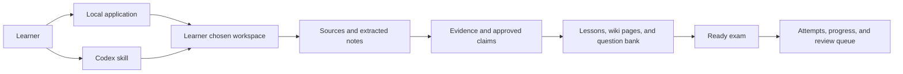
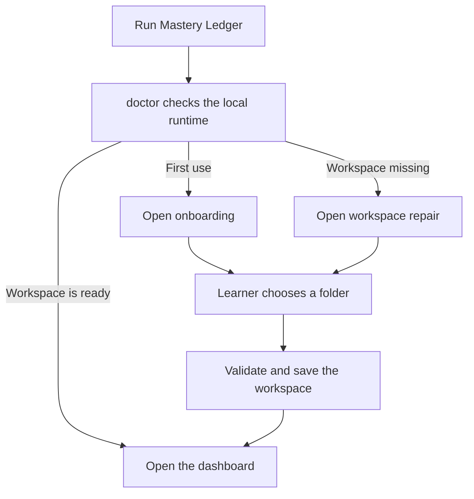
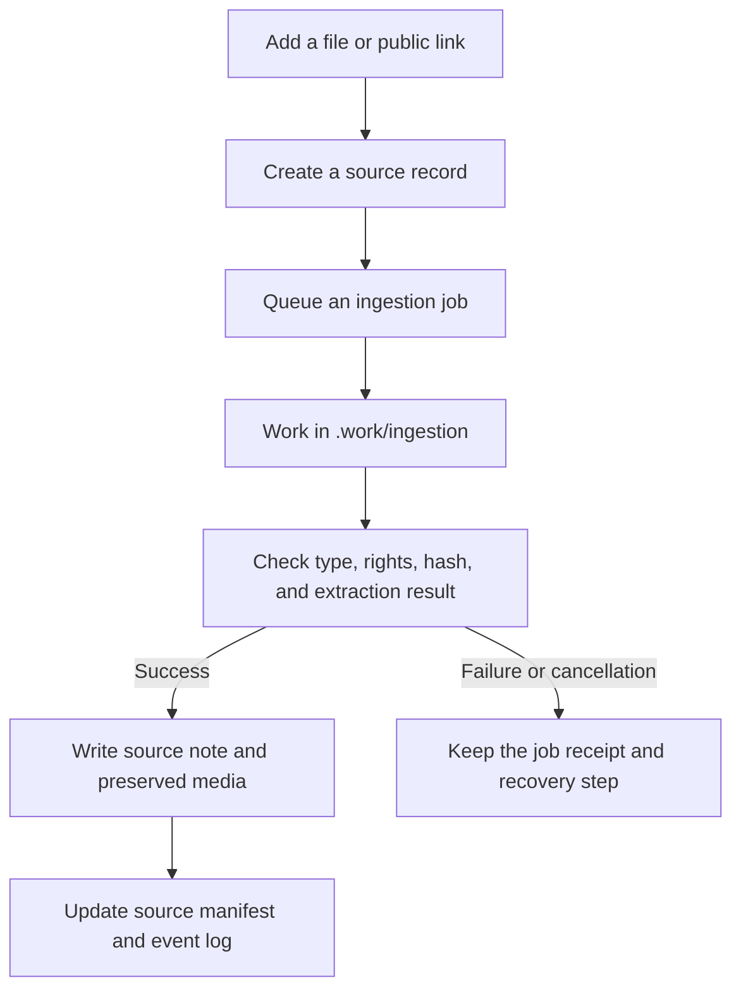
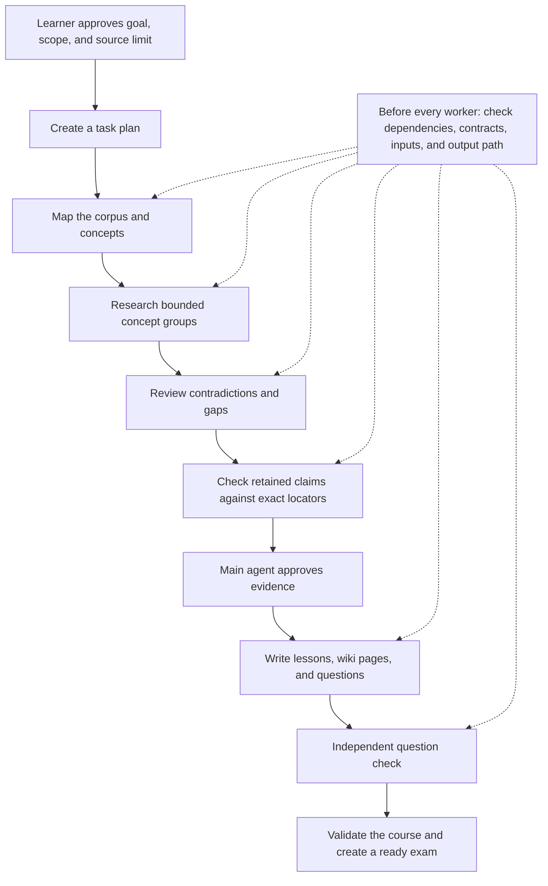
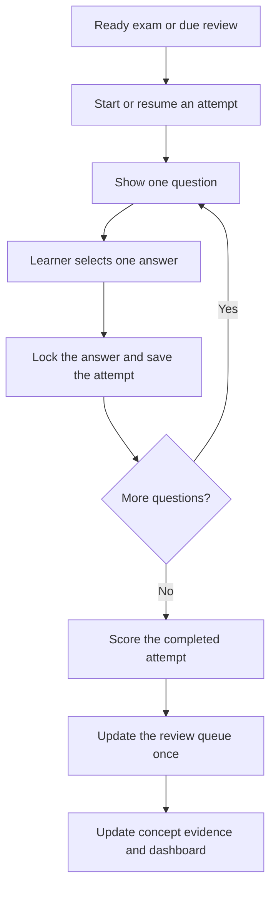
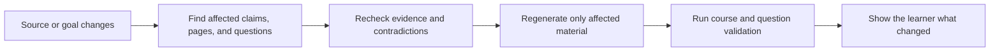

# Mastery Ledger

Mastery Ledger is a local study tool for people who want to keep the trail from a source to a lesson, question, answer, and later review.

Give it a document, link, video, audio file, subtitle file, or a topic. It creates a course in a folder you own. The local application runs the workspace, source inbox, exam screen, review queue, knowledge pages, and activity view. The optional Codex skill builds and checks course material from the same folder.


## Why it exists

Most study tools remember the answer but lose the reason for it. Most chat sessions explain a topic but leave no durable course behind.

Mastery Ledger keeps both.

* Sources remain in the course folder, with extracted notes and locators.
* A claim must survive evidence checks before it reaches a lesson or question.
* An exam is a file, not custom code generated for one session.
* Attempts and review dates stay with the course.
* A changed source can be traced to the material and questions it affects.

## How the parts fit together



The application owns local setup and learner activity. The skill owns the course building workflow. Both read and write portable course files. SQLite stores the local application registry and job queue. It does not own the course itself.

## The workflows

### 1. Set up a workspace

The application asks the learner for a writable folder. It stores that choice locally, checks it on every start, and opens a repair screen if the folder is moved or unavailable. The skill checks the application before it starts work. It does not choose a workspace or install software on its own.



The server listens only on `127.0.0.1`. A session token protects the local API. The course workspace is separate from the application and from the installed skill.

### 2. Bring in sources

The Source Inbox creates a course when needed, records the source before processing, and runs ingestion as a recoverable job. Original files and downloaded media are kept beside the extracted notes. The system does not replace a source with a summary.



Documents, web pages, subtitles, local media, and public video links have separate handlers. Video processing prefers captions. Local transcription is optional and requires an approved local model. The skill never downloads a model, `yt-dlp`, or FFmpeg by surprise.

Each course keeps these files close together:

```text
course/
  source/                 extracted source notes
  source/media/           preserved originals and media
  source-manifest.yaml    source IDs, hashes, rights, and status
  logs/events.jsonl       short observable activity records
  .work/                  temporary and worker material
```

### 3. Build a source checked course

For supplied material, the skill extracts the approved corpus. For a research topic, it first asks for the goal, scope, source limit, and worker budget. It may also run a short diagnostic so the course begins at the learner's level.

No worker writes directly into lessons, wiki pages, questions, or exams. Each worker receives a compiled brief with a role, allowed inputs, required contracts, and one private task folder. The main agent decides what moves into the course.



The research branch is deliberately ordered. Contradiction review comes before final citation review. This avoids spending time verifying claims that will be rejected because they are out of scope, duplicated, stale, or disputed.

Workers write an event shard and completion record inside `.work/runs/<run-id>/tasks/<task-id>/`. The orchestration validator checks the role, input hashes, contract acknowledgements, output path, completion record, and event before any event is merged into the course log.

### 4. Take an exam and schedule the next review

The application reads a ready `exam.json` file and presents one multiple choice question at a time. The answer key and explanation are not included in the first browser response. A wrong answer shows no hint. A correct answer unlocks the explanation. The source panel remains closed until the learner opens it.



The default curve uses days `1, 3, 7, 14, 28, 56, 112, 224, 448, 896, 1792, 3584`. Learners can edit the curve and choose how the change applies. A correct due answer moves a question forward. An incorrect due answer returns it to the first stage. Early practice does not silently advance the schedule.


### 5. Update a course without erasing its history

When a source, goal, or course decision changes, the skill compares hashes, dates, source versions, claims, questions, and concept links. It marks only the affected material for review. Attempts stay in place. Older material is archived or labelled. It is not rewritten as though it never existed.



## What is in the repository

| Area | Purpose |
| --- | --- |
| `src/mastery_ledger/` | FastAPI application, SQLite registry and job queue, course readers, exam service, review service |
| `web/` | React and TypeScript interface |
| `mastery-ledger/` | Installable Codex skill, workflow instructions, contracts, templates, and validators |
| `tests/` | Application contract tests |
| `mastery-ledger/tests/` | Skill, course, evidence, media, and orchestration tests |
| `design-mockups/` | Interface concepts used in this README |
| `RELEASE.md` | Artifact, checksum, attestation, and signing rules |

## Run the preview

This is an unsigned development preview from the repository's `main` branch. It is for testing. Signed installers are not ready yet.

Install the local application:

```powershell
uv tool install "git+https://github.com/Howard-Starfield/Mastery-Ledger.git@main"
mastery-ledger doctor --json
mastery-ledger onboard --open --json
```

After onboarding, `mastery-ledger doctor --json` should report `ready`. If the registered course workspace moves, run:

```powershell
mastery-ledger repair --open --json
```

For a checkout that you are editing:

```powershell
Set-Location D:\AI_projects\Tutor_AI
uv tool install --editable . --force
```

## Install the Codex skill

The skill is optional. It drives the source, research, evidence, and course building workflow. It does not install the application.

```powershell
npx.cmd skills add Howard-Starfield/Mastery-Ledger@mastery-ledger -g -a codex -y --copy
```

After a repository update, refresh the installed copy and open a new Codex task:

```powershell
npx.cmd skills update mastery-ledger -g -y
npx.cmd skills list -g -a codex
```

The skill checks `mastery-ledger doctor --json --skill-version 0.1.0` before it performs a durable course action. It opens onboarding only when the application says onboarding is required.

## Test the project

Run the Python tests from the repository root:

```powershell
python -m venv .venv
& .\.venv\Scripts\python.exe -m pip install -e ".[dev]"
& .\.venv\Scripts\python.exe -m pytest -q
```

Run the web checks:

```powershell
Set-Location web
npm.cmd ci
npm.cmd test
npm.cmd run build
```

The web build is bundled into `src/mastery_ledger/web/`. Commit it with the web source when the interface changes.

## Limits of the current preview

* The review curve is a clear product rule, not FSRS or a validated learning model.
* Local transcription needs the optional `faster-whisper` dependency and a learner approved model. It is not installed during onboarding.
* A stable release still needs signed operating system installers.
* The current wiki stays in the portable `wiki/wiki.json` format. The planned Markdown index migration has not started.

Mastery Ledger is released under the [MIT License](LICENSE).
